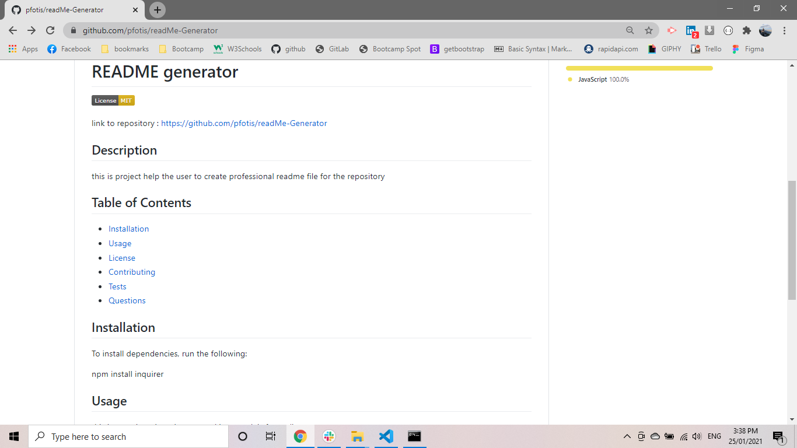
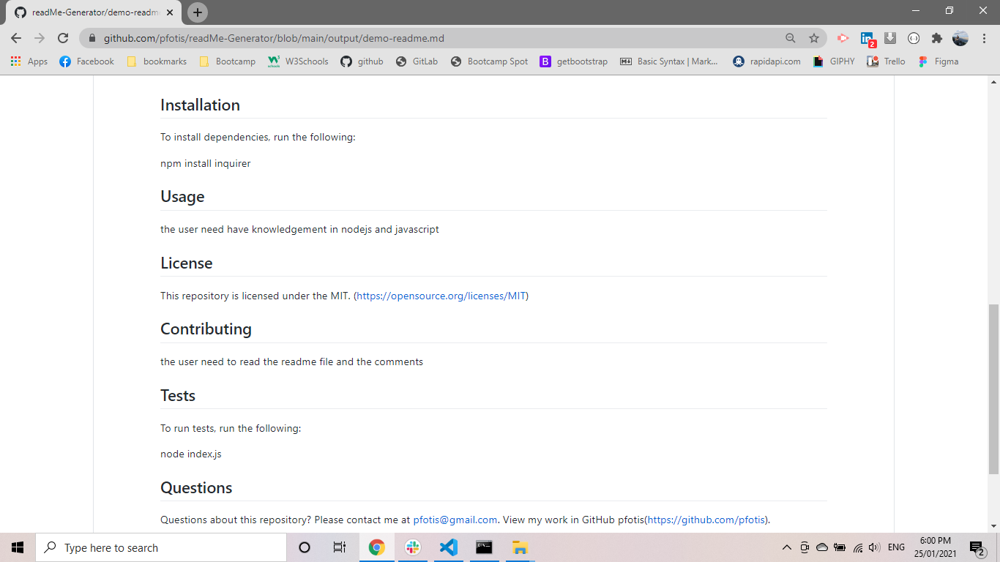

  # readme generator

  link to repository : https://github.com/pfotis/readMe-Generator
  link of the video-demostration :https://drive.google.com/file/d/1W41klD2MLD-vAK8Abcu3CTzQpkCfHNL0/view
  
  
  <iframe src="https://drive.google.com/file/d/1W41klD2MLD-vAK8Abcu3CTzQpkCfHNL0/preview" width="640" 
  height="480"></iframe>

  ## Description

  this project help the user to create a professional readme file for his/her repository and in the future another user to have access to this repository and they contribute.

  the folowing image are from the readme file create in the process of the video

  
  